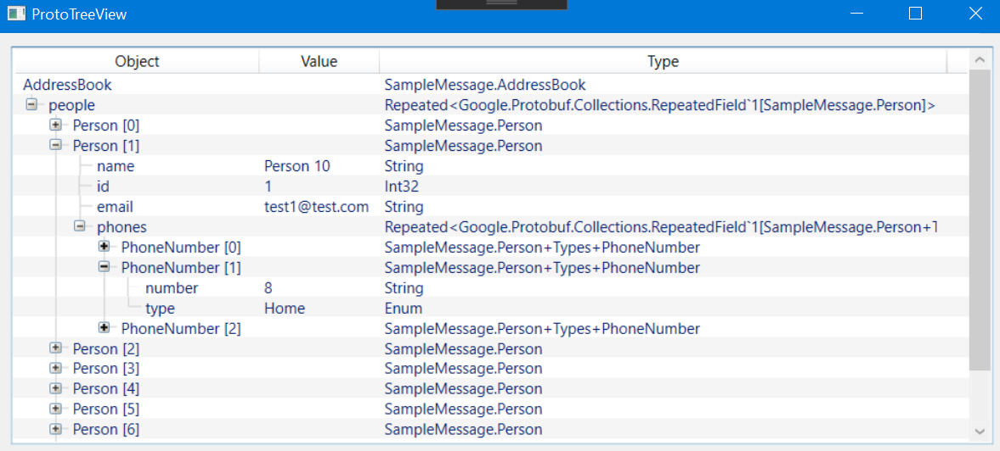

# ProtoTreeView

C# WPF library offering a basic nested tree view for protobuf files.

## Usage
- Integrate the ProtoTreeView library in your project
- Call `ProtoTreeViewWindow treeViewWindow = new ProtoTreeViewWindow(proto message); treeViewWindow.Show();`

or 

- Use the `ProtoTreeViewUserControl` to integrate the tree view into your existing UI with a MVVM pattern.
